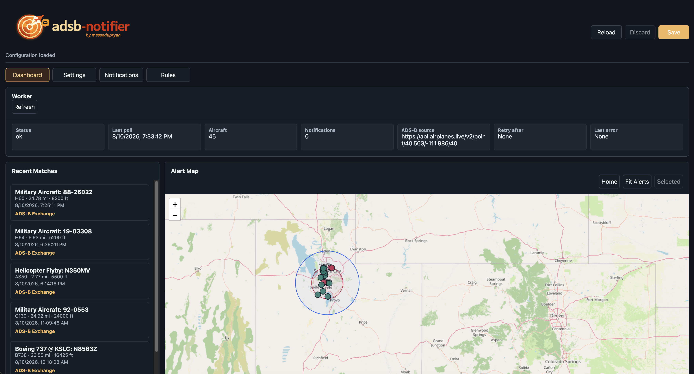
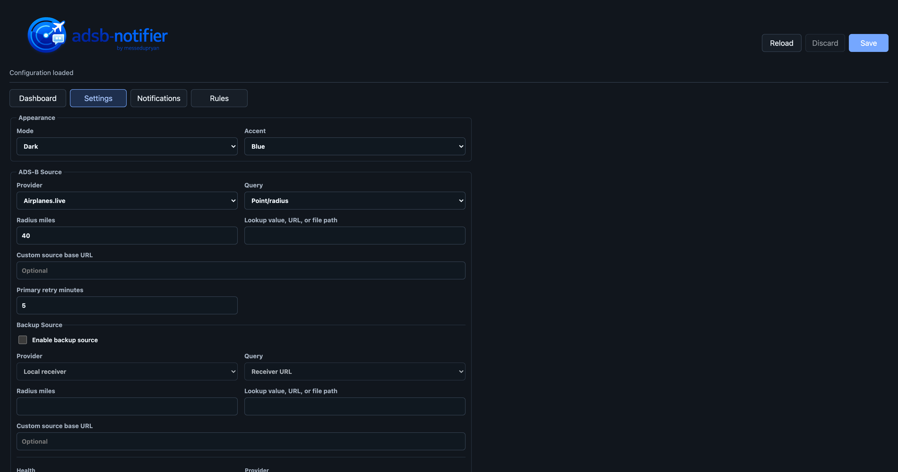
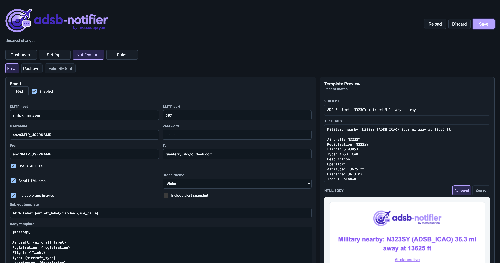
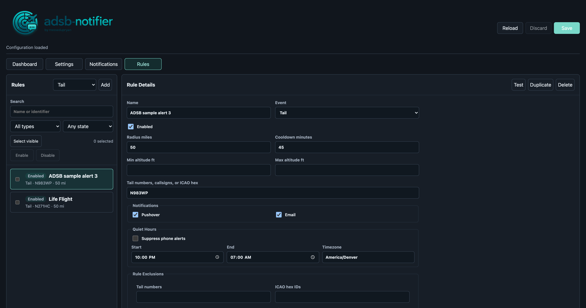
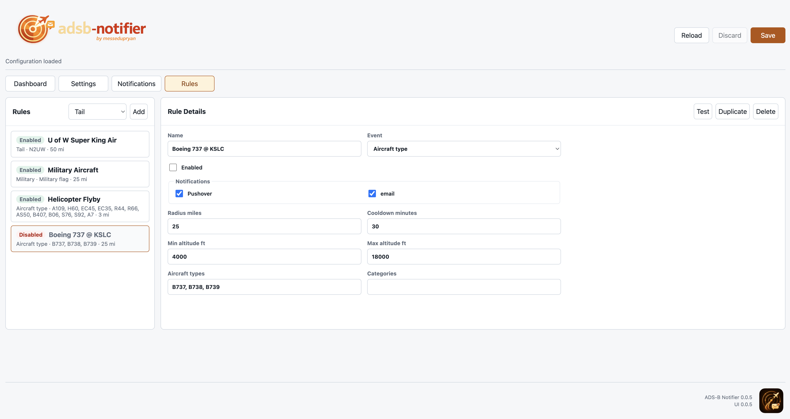

<p align="center">
  
</p>

# 📡 ADS-B Notifier

ADS-B Notifier watches live aircraft data near a configured home location and sends notifications when saved rules match. I created this app to run on my home kube (k3s) cluster so that I can watch military traffic, figure out what loud helicopters just flew over me and to get warnings when cool planes fly over that I can snap photos of.

The project is organized as three deployable components:

- **Worker**: polls ADS-B data, evaluates rules, sends notifications, and writes runtime status.
- **Configuration API**: validates, persists, backs up, and serves configuration and worker status.
- **Web UI**: manages settings, notification providers, rules, live rule tests, and recent matches.

The app can run locally during development or as containers in Kubernetes. See [Development Guide](docs/DEVELOPMENT.md) for setup, testing, container builds, and deployment commands.

<a id="contents"></a>

## 🧭 Contents

- [✨ Features](#features)
- [🖥️ UI](#ui)
- [🔔 Notification Providers](#notification-providers)
- [🏗️ Architecture](#architecture)
- [🗂️ Project Layout](#project-layout)
- [⚙️ Configuration Overview](#configuration-overview)
- [🗺️ Dashboard](#dashboard)
- [🏷️ Versioning](#versioning)
- [🛠️ Development](#development)
- [🙏 Credits and Disclaimer](#credits-and-disclaimer)
- [🚧 Status](#status)

<a id="features"></a>

## ✨ Features

- Rule matching for tail numbers, callsigns, ICAO hex IDs, military aircraft, aircraft types, ADS-B categories, and circling behavior.
- Radius, minimum altitude, maximum altitude, stale-aircraft, and cooldown filters.
- Direct `aircraft.json` feed support for common dump1090/readsb/tar1090-style data.
- Online source adapters for Airplanes.live and ADSB.lol.
- HTTP rate-limit handling with `Retry-After` support and capped exponential backoff.
- Military matching that understands readsb/Airplanes.live `dbFlags`.
- Optional TIS-B inclusion for military rules.
- Per-rule notification provider selection from globally enabled providers.
- Live rule testing against the configured ADS-B source.
- Provider-specific notification templates.
- Worker status and recent match history.
- Dashboard map with home location, active rule radii, recent match markers, selected-match highlighting, and Airplanes.live aircraft links.
- Light/dark UI modes, accent themes, themed logo assets, and theme-aware favicon.

<a id="ui"></a>

## 🖥️ UI
The UI is broken into sections by tabs. Below are example screenshots of each tab showing the variety of themes.

#### Dashboard overview


#### General Settings


#### Notification settings



#### Rule editor





<a id="notification-providers"></a>

## 🔔 Notification Providers

Current notification support includes:

- SMTP email
- Pushover push notifications
- Twilio SMS

I found Twilio to be overly cumbersome, and not worth the cost. I am using email and Pushover notifications. I left Twilio support in the app, in case I ever do want to leverage SMS, but I doubt I ever will.

<a id="architecture"></a>

## 🏗️ Architecture

```text
ADS-B source (ADSB.lol, Airplanes.live, or direct aircraft.json)
    |
    v
Worker service
    | evaluates rules
    | sends notifications
    | writes status
    v
Shared config/status storage
    ^
    |
Configuration API <---- Web UI
```

In Kubernetes, the API owns persistence of the live configuration file and serves a redacted configuration view to the UI. The worker reads the live configuration file from shared storage and writes status so the UI can display operational state and recent matches.

<a id="project-layout"></a>

## 🗂️ Project Layout

```text
adsb_notifier/        Python package for worker, API, parsing, rules, status, and notifiers
tests/                Python test suite
ui/                   Static web UI and no-cache development server
charts/adsb-notifier/ Helm chart for Kubernetes deployment
k8s/                  Raw Kubernetes manifests
docs/                 Development and operational documentation
config.example.json   Example configuration
Makefile.example      Example Make targets for local, test, build, and deploy commands
```

<a id="configuration-overview"></a>

## ⚙️ Configuration Overview

Configuration is JSON. The checked-in [config.example.json](config.example.json) shows the main structure:

- `home`: latitude and longitude used for distance calculations and map centering
- `poll_seconds`: worker polling interval
- `stale_aircraft_seconds`: ignore aircraft that have not been seen recently
- `recent_matches_window_hours`: how long recent matches remain in status history
- `adsb_url` or `adsb_source`: ADS-B source configuration. The current example defaults to ADSB.lol; Airplanes.live and direct `aircraft.json` endpoints are also supported.
- `notifications`: provider configuration and templates
- `rules`: alert rules

Secrets can be referenced as environment variables with `env:NAME`, for example:

```json
"password": "env:SMTP_PASSWORD"
```

Rules support these event values:

- `tail`
- `military`
- `aircraft_type`
- `circling`

Example rule:

```json
{
  "name": "Tail number near home",
  "event": "tail",
  "tail_numbers": ["N12345"],
  "radius_miles": 25,
  "cooldown_minutes": 60,
  "notification_providers": ["pushover", "email"]
}
```

<a id="dashboard"></a>

## 🗺️ Dashboard

The dashboard shows worker health, recent matches, and a map view. Recent matches include observed timestamps, aircraft metadata, notification provider selections, map positions when available, and Airplanes.live links.

The map is centered around the configured home location and can show:

- Home marker
- Active rule radii
- Recent alert markers
- Track direction hints
- Selected match highlighting

<a id="versioning"></a>

## 🏷️ Versioning

The project is currently in beta and uses SemVer-style `0.0.x` versions. The worker, API, UI, Helm chart, Python package, and container images share the project version during beta.

See [Versioning and Promotion](docs/VERSIONING.md) for the branch flow, image tag strategy, and promotion checklist.

<a id="development"></a>

## 🛠️ Development

See [Development Guide](docs/DEVELOPMENT.md) for:

- Installing dependencies
- Running the API, UI, and worker locally
- Running tests
- Building container images
- Deploying with Helm
- Managing runtime secrets

<a id="credits-and-disclaimer"></a>

## 🙏 Credits and Disclaimer

ADS-B Notifier is an independent personal project and is not affiliated with, endorsed by, or sponsored by Airplanes.live, ADSB.lol, OpenStreetMap, Leaflet, Pushover, Twilio, or any aircraft tracking service or notification provider.

When configured to use Airplanes.live, aircraft data and aircraft detail links may come from Airplanes.live. Please be a good neighbor: follow their API guide and terms, keep polling reasonable, and remember that public access can change. If this project is useful to you, consider becoming an Airplanes.live feeder and contributing ADS-B coverage back to the community.

Dashboard maps are rendered with Leaflet and OpenStreetMap tiles. OpenStreetMap attribution is displayed in the map UI.

<a id="status"></a>

## 🚧 Status

This project is under active development. I haven't really focused on making this something for public consumption. I am sharing this so that my friends (Tom and Matt) can see what I am working on.
